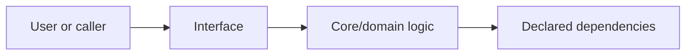

# <Project Name> — Verified Brief

Project ID: `<project-id>`  
Folder: `<relative/path>`  
Brief status: `<draft/owner-confirmed/inferred-and-verified>`  
Last verified: `<UTC timestamp>`

## One-sentence outcome

`<Who gets what useful outcome, and what makes this project distinct?>`

## Goal sources

| Priority | Source | What it establishes | Confidence |
|---:|---|---|---|
| 1 | `<owner message / project README / issue / code>` | `<goal>` | `<high/medium/low>` |

## Intended users and problem

- Primary user: `<who>`
- Problem: `<pain/job>`
- Successful outcome: `<observable result>`

## Primary acceptance scenarios

Use real user-visible or interface-visible outcomes.

1. **Happy path:** Given `<state>`, when `<action>`, then `<persistent/visible result>`.
2. **Important failure:** Given `<failure/hostile input>`, when `<action>`, then `<safe behavior>`.
3. **Recovery/resume:** Given `<interruption>`, when `<retry/resume>`, then `<idempotent result>`.

## Scope now

- `<capability>`
- `<capability>`

## Explicit non-goals

- `<not needed for this project's outcome>`

## Constraints

- Existing stack/runtime: `<derive from repository; do not invent>`
- Deployment/environment: `<facts>`
- Data/privacy/security: `<facts>`
- Cost/provider limits: `<facts>`
- Compatibility: `<facts>`

## Architecture baseline

Replace this with the real current/target architecture and mark planned components clearly.

## Quality and portfolio gates

Select only applicable gates and make them measurable.

- [ ] primary flow works end to end
- [ ] meaningful failure paths are safe and tested
- [ ] project-native type/lint/test/build checks pass
- [ ] architecture and decisions match implementation
- [ ] proof/evaluation metric is reproducible
- [ ] README/demo/limitations are current
- [ ] deployment verified, if deployment is in scope

## Assumptions and open questions

| ID | Assumption/question | Evidence | Risk if wrong | Resolution |
|---|---|---|---|---|
| `A-001` | `<statement>` | `<why inferred>` | `<impact>` | `<verify/ask/accepted>` |

## Definition of done

This project is done when the acceptance scenarios and selected quality gates pass, project audit has no open critical/high findings, proof is recorded, and any unverified external step is explicitly blocked rather than claimed complete.
