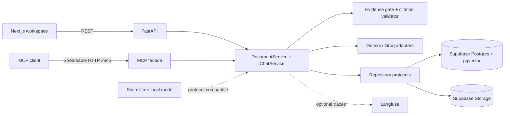

# DocuMind — Evidence-First RAG + MCP

> Upload business PDFs, ask questions, and receive page-grounded answers—or an explicit refusal when the evidence is missing. The same service layer powers REST, the web workspace, and Streamable HTTP MCP tools.

**Status:** local implementation and deterministic evaluation verified · **Live demo:** blocked on owner-managed cloud credentials · **Video:** capture plan in [DEMO_SCRIPT.md](DEMO_SCRIPT.md)

## Why this exists

Most document-chat demos optimize for always producing an answer, which makes unsupported confidence difficult to detect. Business users instead need to see which source supports a claim and when the system does not know. DocuMind treats an evidence-backed refusal as a successful outcome and records the retrieval behind every generated answer.

The differentiator is simple: **model output is never trusted to validate itself**. Deterministic code accepts only citations that map to retrieved chunks and replaces an unsupported answer with the standard refusal.

## What to show in 90 seconds

1. Upload `sample_docs/refund_policy.pdf` and wait for resumable processing to complete.
2. Ask `What are the refund conditions?` and expand the page-one source.
3. Ask `What is the CEO's salary?` and show the amber insufficient-evidence response.
4. Run `python scripts/test_mcp.py` to call every MCP tool and verify isolation.

Current screenshots are intentionally not fabricated. [DEMO_SCRIPT.md](DEMO_SCRIPT.md#screenshot-capture-plan) lists the three captures to take from a verified build.

## Architecture



The default local path uses memory repositories and deterministic providers so behavior is reproducible without secrets. Live adapters activate only when configured; local results do not claim cloud availability.

## Capabilities

- Strict PDF extension, MIME, size, and magic-byte validation.
- Page-aware, idempotent, resumable ingestion with a durable cursor.
- Session-scoped vector retrieval, overlap deduplication, page diversity, and context caps.
- Evidence gate that avoids the chat-provider call when no source clears the threshold.
- Typed output, derived confidence, and deterministic citation validation.
- Groq/Gemini retry and fallback boundaries with structured temporary-unavailable errors.
- REST API and four MCP tools over one service graph.
- Frozen 15-case evaluation and optional non-blocking Langfuse observation.
- Web states for upload/process, empty/loading/error, grounded sources, and honest refusal.

## Key engineering decisions

- [One shared service layer serves REST and MCP](DECISIONS.md#1-shared-service-layer-for-rest-and-mcp).
- [Serverless ingestion advances in resumable page batches](DECISIONS.md#3-resumable-page-batches-for-serverless-ingestion).
- [The evidence threshold is configurable and prevents unnecessary LLM calls](DECISIONS.md#5-configurable-035-evidence-threshold).
- [Citations are validated against retrieval instead of trusted from model JSON](DECISIONS.md#6-deterministic-citation-validation).
- [HNSW cosine search fits incremental, read-heavy indexing](DECISIONS.md#7-hnsw-cosine-index).

All accepted tradeoffs are in [DECISIONS.md](DECISIONS.md). The [adversarial audit](AUDIT.md) preserves findings instead of hiding them.

## Evaluation results

`python evals/run.py` uses deterministic local providers and a frozen fictional corpus. These scores are regression evidence for 15 authored cases—not production quality claims or a live independent LLM judge.

| Metric | Score | Cases |
|---|---:|---:|
| Retrieval hit | 100% | 10 |
| Faithfulness (offline support judge) | 100% | 15 |
| Citation accuracy | 100% | 15 |
| Refusal correctness | 100% | 5 |

Methodology, configuration, and limitations: [docs/evaluation.md](docs/evaluation.md).

## Failure handling

| Failure mode | Behavior | Representative proof |
|---|---|---|
| Corrupt, encrypted, empty, or spoofed PDF | Sanitized validation/failed status; no invented content | `backend/tests/unit/test_pdf.py`, `backend/tests/service/test_document_service.py` |
| Embedding failure mid-processing | Cursor does not advance; retry upserts without duplicate chunks | `backend/tests/service/test_document_service.py` |
| No relevant evidence | HTTP 200 refusal, no citations, no chat call | `backend/tests/service/test_chat_service.py`, `backend/tests/api/test_api.py` |
| Prompt-injection question | Rejected before embedding/generation | `backend/tests/unit/test_screening.py`, `backend/tests/service/test_search.py` |
| Fabricated model citation | Invalid reference stripped; citation-free result becomes refusal | `backend/tests/unit/test_citations.py` |
| Primary model rate limit/timeout | Bounded retry, secondary fallback, then structured 503 | `backend/tests/unit/test_resilient_provider.py` |
| Malformed structured output | One corrective attempt, then safe refusal | `backend/tests/service/test_chat_service.py` |
| Cross-session resource access | Not-found/tool error without leaking ownership | `backend/tests/api/test_api.py`, `backend/tests/service/test_mcp_facade.py` |

## Technology

| Layer | Choice |
|---|---|
| API/domain | Python 3.11+, FastAPI, Pydantic v2 |
| PDF and retrieval | pypdf, Gemini embeddings adapter, pgvector cosine/HNSW |
| Generation | Groq primary/fallback routing with Gemini support; deterministic local provider |
| Persistence | Supabase Postgres + Storage adapters; memory repositories locally |
| MCP | Official Python MCP SDK, stateless Streamable HTTP |
| Frontend | Next.js 16, React 19, TypeScript |
| Verification | pytest, Vitest, TypeScript, Next production build, frozen evaluation |
| Observability | Optional Langfuse adapter that cannot fail the primary path |

## Quickstart

### 1. Backend

```bash
cd projects/documind-rag-mcp
python -m venv .venv
source .venv/bin/activate
pip install -r requirements.txt pytest pytest-asyncio reportlab
cp .env.example .env
cd backend
uvicorn app.main:app --reload --port 8000
```

No keys are required for deterministic local mode. API docs: `http://localhost:8000/api/docs`; MCP: `http://localhost:8000/mcp`.

### 2. Frontend

```bash
cd projects/documind-rag-mcp/frontend
cp .env.example .env.local
npm ci
npm run dev
```

Open `http://localhost:3000`. Configure `NEXT_PUBLIC_API_BASE_URL` when the backend uses another origin.

### 3. Live persistence and providers

Apply `migrations/001` through `005` in order to an owner-managed Supabase project, then configure only the variables needed in `.env.example`. Live mode must be evaluated and smoke-tested separately; do not use service-role keys in the browser.

## API examples

Create a stable session UUID once and reuse it:

```bash
SESSION_ID="$(python -c 'import uuid; print(uuid.uuid4())')"

curl -sS -X POST http://localhost:8000/api/documents/upload \
  -H "X-Session-ID: $SESSION_ID" \
  -F "file=@sample_docs/refund_policy.pdf;type=application/pdf"
```

After processing the returned document ID, ask a question:

```bash
curl -sS -X POST http://localhost:8000/api/chat \
  -H "X-Session-ID: $SESSION_ID" \
  -H "Content-Type: application/json" \
  -d '{"question":"What are the refund conditions?"}'
```

Representative local response shape:

```json
{
  "conversation_id": "<uuid>",
  "message_id": "<uuid>",
  "result": {
    "answer": "<answer supported by retrieved text>",
    "citations": [{"document_id": "<uuid>", "filename": "refund_policy.pdf", "page": 1, "excerpt": "<retrieved excerpt>", "chunk_id": "<uuid>"}],
    "grounded": true,
    "confidence": 0.0
  }
}
```

The actual confidence is derived from that run's retrieval scores. See [docs/mcp.md](docs/mcp.md) for client setup and tool contracts.

## Verification

```bash
# backend
cd projects/documind-rag-mcp/backend
python -m pytest -q

# evaluation
cd ..
python evals/run.py

# frontend
cd frontend
npm ci
npm test
npm run typecheck
npm run build
npm audit --omit=dev

# MCP smoke (with backend running on port 8000)
cd ..
python scripts/test_mcp.py
```

Saved proof and exact observed counts are maintained in `../../docs/projects/documind-rag-mcp/PROOF.md` rather than inferred from badges.

## Limitations and deployment status

This is not production authentication: caller-supplied session UUIDs are a demo isolation boundary. Local embeddings and the offline support judge prove pipeline regressions, not live semantic quality. Scanned PDFs need OCR; adversarial source text remains a residual risk; in-memory data disappears on restart; and browser-driven batching should become a durable queue at scale.

The intended Vercel topology uses separate backend and frontend project roots. Supabase policies, live provider quality, Langfuse traces, Vercel routing, and a public URL are still external verification gates. See [docs/limitations.md](docs/limitations.md) and [docs/mcp.md](docs/mcp.md#deployment-topology) before deployment.

## Documentation map

- [RAG pipeline](docs/rag-pipeline.md)
- [MCP transport, tools, and client setup](docs/mcp.md)
- [Evaluation methodology and saved results](docs/evaluation.md)
- [Limitations and residual risk](docs/limitations.md)
- [Engineering decisions](DECISIONS.md)
- [Adversarial audit and remediation](AUDIT.md)
- [90–120 second demo script](DEMO_SCRIPT.md)

---

Built as a proof-of-work portfolio project. Add verified author, repository, license, video, and live-demo links before publication; none are invented here.
