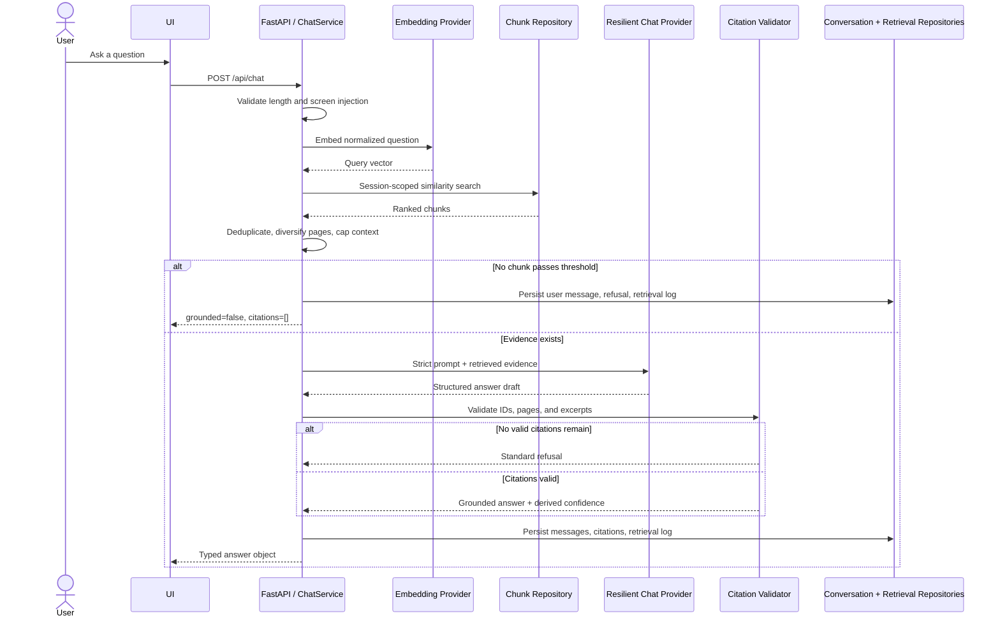

# RAG Pipeline

DocuMind treats refusal as a successful safety outcome, not an exception.

## Ingestion stages

1. Validate `.pdf` extension, `application/pdf` MIME, `%PDF-` magic bytes, and the 10 MB limit before storage.
2. Extract text page by page with `pypdf`; encrypted, corrupt, and text-empty inputs become a sanitized failed document.
3. Chunk within page boundaries around 800 estimated tokens with 15% overlap.
4. Embed one bounded page batch, then upsert chunks by `(document_id, page_number, chunk_index)`.
5. Advance `last_processed_page` only after durable writes. A retry resumes at the previous committed cursor.
6. Mark the document ready only after all pages finish.

## Retrieval and confidence

`ChatService` requests up to `RETRIEVAL_TOP_K` cosine matches scoped to the caller's session and optional document IDs. Retrieval shaping removes near-duplicate overlap, prefers page diversity, and caps context near `CONTEXT_TOKEN_CAP`. Confidence is derived from accepted retrieval similarities; it is not generated by the LLM.

## Evidence and injection boundaries

Question screening rejects known prompt-injection forms before embedding. Retrieved documents remain untrusted text: the system prompt labels them evidence, not instructions. The final deterministic validator accepts only citations that map to a retrieved chunk/page. This reduces blast radius but does not eliminate adversarial semantic content; see [limitations](limitations.md).
