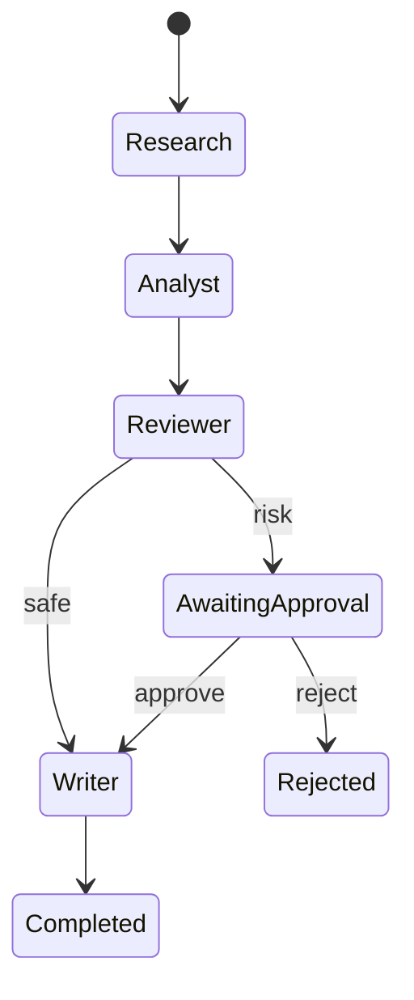

# State machine

```mermaid
stateDiagram-v2
  [*] --> Research
  Research --> Analyst
  Analyst --> Reviewer
  Reviewer --> AwaitingApproval: risk
  Reviewer --> Writer: safe
  AwaitingApproval --> Writer: approve
  AwaitingApproval --> Rejected: reject
  Writer --> Completed
```

Every node is a persistence boundary. Duplicate terminal decisions are safe no-ops.
