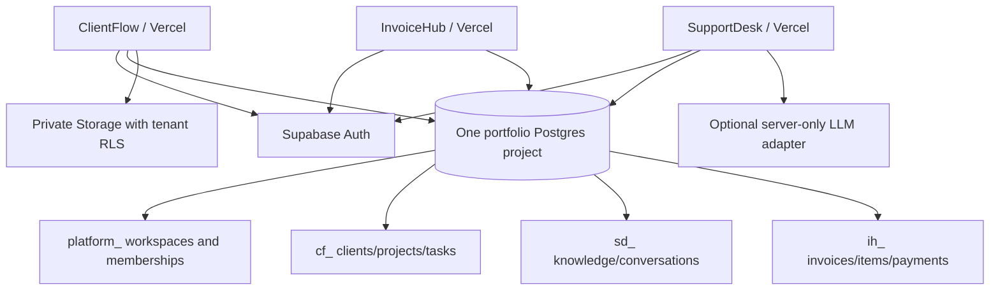

# Suite architecture and decisions

**Planned target.** Read STATUS and project ledgers for actual implementation. Do not treat this diagram as a deployed system.

## Stack
| Layer | Choice | Reason |
|---|---|---|
| UI + server | Next.js App Router, React, TypeScript strict | One language, SSR, server actions/route handlers, portable Node deployment |
| Design | Tailwind 4 tokens, accessible native elements; selectively shadcn/Radix | Own the visual language; use tested dialog primitives instead of rebuilding focus management |
| Data/auth/files | Supabase PostgreSQL, Auth, private Storage | Relational constraints and independently enforced row permissions |
| Validation | Zod + SQL constraints | Friendly input errors plus database integrity against bypass |
| Testing | Vitest, Playwright, axe, local Supabase SQL tests | Pure logic, workflows, accessibility, actual data isolation |
| Delivery | GitHub, Vercel personal demos | Reviewable changes and preview builds; no dependency on Genspark runtime |

## Directory contract
```text
suite/
  START_HERE.md, STATUS.json
  docs/                       specifications, operations and learning
  scripts/verify-state.mjs    credential-free continuity checks
  apps/
    clientflow/               independent Next app/package-lock.json
    supportdesk/              created only after ClientFlow release gate
    invoicehub/               created only after SupportDesk release gate
  supabase/
    config.toml               local services, migrations run from suite/
    migrations/               shared platform then product-prefixed tables
    tests/                    SQL authorization and invariants
    seed.sql                  synthetic local-only records
```
Separate app packages simplify Vercel root selection and copying. Do not introduce shared runtime packages until duplication is meaningful; shared contracts live in docs and database. Credentials and node_modules never travel with source.



## Authentication and access flow
```mermaid
sequenceDiagram
    actor User
    participant UI as Browser
    participant Auth as Supabase Auth
    participant App as Next server / Proxy
    participant DB as Postgres RLS
    User->>UI: Sign in with GitHub
    UI->>Auth: OAuth redirect
    Auth-->>App: Code at allowed callback URL
    App->>Auth: Exchange code for cookie session
    App-->>UI: Safe internal redirect
    UI->>App: Mutation with form input
    App->>Auth: Verify identity (getUser/getClaims)
    App->>App: Validate input; check app/workspace role
    App->>DB: Query with user's JWT (never service key)
    DB->>DB: Enforce RLS + constraints + transaction
    DB-->>App: Allowed rows or rejected operation
    App-->>UI: Minimal DTO or actionable safe error
```
Cookie session is browser-held authentication material. RLS checks current membership, not a long-lived client claim about roles. Proxy refresh is not the sole authorization layer. No private pages cached across users; no ISR on authenticated responses. Workspace IDs are selectors, not secrets.

## Data boundary
Server Components read database through a `server-only` data-access module. Client Components own interactions, not authorization. Server Actions validate again, return a discriminated success/error object, and revalidate scoped paths. Route handlers are for OAuth callbacks, file/PDF downloads, and support message endpoints. Never return raw SQL/provider errors or whole auth objects to the browser.

## Architectural decisions
- **ADR-001:** One DB for economical demos. Namespaced tables (`platform_`, `cf_`, `sd_`, `ih_`) in `public`; RLS is still mandatory. Global Auth means identity is shared deliberately. Production separation is an environment migration, not new app code.
- **ADR-002:** Each `platform_workspace` has immutable `app` enum. Membership alone is insufficient: every product permission helper checks matching app. Creating a workspace and its owner membership is one transaction.
- **ADR-003:** Conventional CRUD through user-scoped Supabase; transactional state transitions through narrowly scoped Postgres functions. Security-definer only when necessary, fixed empty search_path, qualified identifiers, explicit grants, auth check inside.
- **ADR-004:** Explicit `/demo` synthetic sandbox separate from authenticated `/app`. Live errors never show demo data. Public demo may use per-tab memory, clearly labeled; this proves UI only.
- **ADR-005:** No background function continues after response. Support ingestion is bounded/chunked, resumable DB job records later if needed. No fake queue in process memory on serverless.
- **ADR-006:** SQL migrations are append-only once applied. Generated TS database types from local schema; no hand-maintained fake production types.
- **ADR-007:** Staged delivery: first workbench, then tenant schema, auth, persistence, advanced features. Owner deployment only after code gates; hosted smoke checks still required.

## Performance/security risks
Cross-tenant foreign keys, stale memberships, broad public buckets, service-role leakage, user data in shared caches, open redirects, unbounded search/upload, race conditions and provider abuse have dedicated gates. Index workspace + status/date, paginate 25 rows, avoid N+1 reads; measure with query plans before indexing everything. No invented latency metrics.
