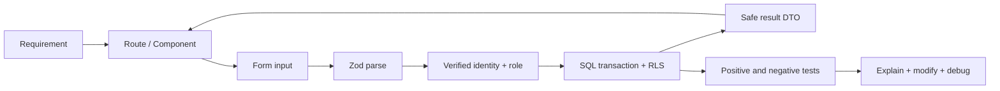

# Learn to own the code, not recite it

This is a working curriculum. Planned architecture is clearly labeled; each feature must add an explanation of the implementation that actually exists. No documentation can instantly give deep understanding: demonstrate it with changes and debugging.

## Learning ladder
| Step | Understand | Prove it |
|---|---|---|
| HTML/CSS | semantic forms, grid, responsive breakpoints, focus and labels | Navigate without mouse; fix one mobile layout issue |
| JavaScript/TypeScript | arrays, immutability, promises, union narrowing, types vs runtime validation | Add a status safely and fix resulting compile/test failures |
| React | props, state, effects, controlled inputs, render/hydration | Explain why changing one record updates the list; avoid mutation |
| Next.js | App Router, server/client components, routes, actions, errors, cache | Trace request from URL to rendered component; no client secrets |
| HTTP/Auth | cookies, redirects, sessions, OAuth, 401 vs 403, trust boundaries | Explain valid login with denied record access |
| Postgres | PK/FK, unique/check constraints, joins, indexes, transactions | Add a field/migration and reject cross-workspace relation |
| Authorization | RLS USING/WITH CHECK, role changes, user-scoped queries | Bypass UI with direct API and still get denial |
| Testing | unit/integration/E2E, fixture vs real evidence | Write a regression that fails before the fix |
| Operations | env, logs, deployments, backups, Git reverts | Roll back code and explain why it doesn't undo data |

## Read each feature using this worksheet
1. User need in one sentence.
2. Start URL/component and exact handler symbol.
3. Input shape and where untrusted input enters.
4. Runtime validation, identity check, role check and SQL constraint.
5. Query/table names and what side effects are atomic.
6. Return DTO and UI update/revalidation.
7. Failure branches (including stale session and lost network).
8. Tests that prove it, plus what tests do not prove.
9. One tradeoff and one independently completed modification.

## Interview questions with answer guides
**Why isn't TypeScript enough?** It checks code at build time; HTTP/form/provider data can be malicious at runtime. Parse with Zod; also constrain the database against alternate clients.

**Authentication vs authorization?** Identity answers who; authorization answers which operations/records. A signed-in user still fails RLS for another workspace.

**Why use RLS if actions check roles?** Direct Data API calls bypass the UI/actions; RLS is an independent boundary. It is only trustworthy when policies and grants are tested.

**What does a Server Component protect?** Server execution can keep secrets/server dependencies out of a browser bundle; it doesn't automatically authorize data or make serialized props private. Return minimal DTOs.

**Why a transaction?** Related writes either all commit or all roll back. Workspace + owner, invoice + unique number, and payment + audit cannot be left half-written.

**How do you handle concurrency?** Versioned updates or row locks depending on operation. A stale version gets an explicit conflict instead of last-write-wins; financial issuance serializes numbering.

**Why isn't a passing browser demo enough?** It tests selected UI flows. It doesn't prove direct API permissions, race conditions, billing setup, or recovery.

**How did AI help?** Be concrete: scaffolding, proposed tests, review suggestions. Then show a bug you reproduced, a test you added and an architecture decision you can defend. Don't claim every line was handwritten.

## Practical ownership exam
Without asking AI to regenerate the app: add optional project reference field end-to-end; introduce and diagnose a validation error; test an unauthorized API request; revert the bad commit; restore a sample DB backup; explain one complete request in three minutes. AI assistance is allowed, but you must predict outcomes before running code and verify results independently.
