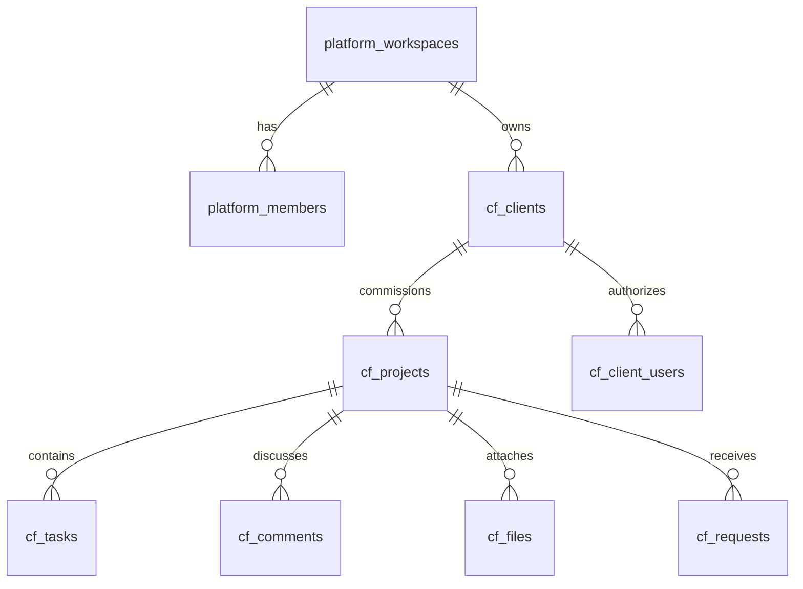
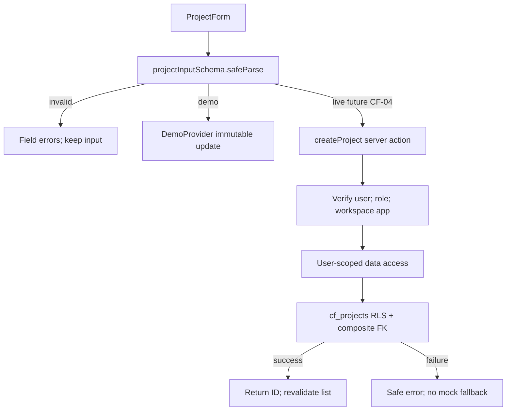

# ClientFlow architecture and schema

Target stack and shared auth: ../../ARCHITECTURE.md. Schema below is planned until CF-02. Current implementation scope: CF-01.

## Routes
| Route | Boundary / purpose |
|---|---|
| `/` | Entry redirects to explicit demo initially; later product intro |
| `/demo` | Sample overview |
| `/demo/projects` | URL-backed filters and table/board |
| `/demo/projects/new` | Sample project form |
| `/demo/projects/[id]` | View/edit sample project |
| `/demo/guide` | Honest demo boundary and architecture explanation |
| `/login`, `/auth/callback`, `/auth/recovery` | Planned auth routes CF-03 |
| `/app/[workspaceId]/...` | Planned verified identity + workspace membership; server DAL reads |
| `/portal/[workspaceId]/projects/[id]` | Planned client-project authorization; no internal metadata |

## Planned relational model
| Table | Fields / constraints / indexes |
|---|---|
| `cf_clients` | id UUID, workspace_id, name 1–100, contact_name/email, archived_at, created_by/timestamps; UNIQUE(workspace_id,id); index(workspace_id,name) |
| `cf_projects` | id, workspace_id, client_id composite FK, name, description, status check, due_date date nullable, version positive int, created_by/timestamps; index(workspace_id,status,due_date) |
| `cf_tasks` | id, workspace_id, project_id composite FK, title 1–200, status todo/doing/done, assigned_to nullable, due_date, version, timestamps; index(workspace_id,project_id,status); assignee membership verified transactionally |
| `cf_client_users` | (workspace_id,client_id,user_id) PK; composite client FK and membership FK; mutation only through reviewed invite/management functions |
| `cf_comments` | id, workspace_id, project_id, task_id nullable, author_id, body 1–4000, visibility internal/portal; same-project task reference enforced; index(workspace_id,project_id,created_at) |
| `cf_files` | id, workspace_id, project_id, uploader_id, object_path unique, original_name, MIME/size, visibility, upload_state, timestamps; path not authority |
| `cf_requests` | id, workspace_id, project_id, requester_id, title/body, status open/accepted/closed; client cannot choose requester |
| `cf_notifications` | id, workspace_id, recipient_id, safe event reference, read_at, created_at; only recipient reads/marks own notification |

## Data flow: create project

## Server contracts (planned)
`createProject(workspaceId,unknownInput)` → `{ok:true,id}` or `{ok:false,code,fieldErrors?,message}`. `updateProject(workspaceId,id,expectedVersion,input)` → same result, conflict if zero rows due to version. DAL restricts returned columns. Route params validated. Never trust passed creator/role/client affiliation. Client portal gets a separate DTO without internal notes/contacts.

## Files and storage
Private `clientflow-files` bucket. Paths include workspace/project/random object ID; RLS derives scope, not filename trust. Limit 5 MiB; allow PDF/PNG/JPEG/plain text, validate type/extension and bytes where practical; no SVG/HTML executable content. Return short-lived signed downloads only after membership and visibility check. Storage policy independently restricts bytes. Hosted malware scanning is not promised on free tier; document residual risk and never use real sensitive files in public demo.

## Security/performance
Shared platform role helper checks `app=clientflow`. Internal users see workspace records; clients only linked client records and portal-visible rows. Composite FKs prevent cross-tenant relations. Use row-version conflicts; paginated list counts do not leak other workspaces. No admin key, global shared cache or public bucket.
