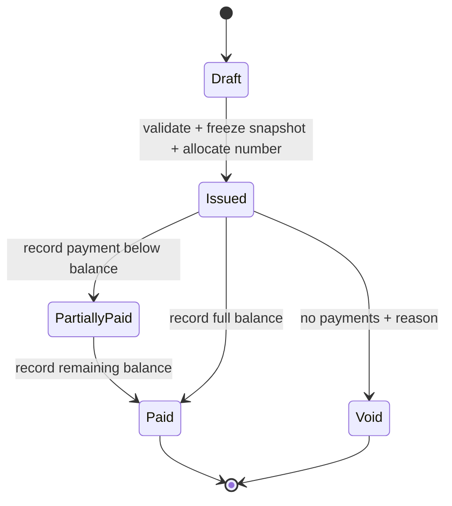
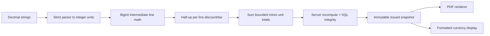

# InvoiceHub architecture and schema (planned)

## Routes
`/demo`, `/app/[workspaceId]/invoices`, `/invoices/new`, `/invoices/[id]`, `/customers`, `/expenses`, `/reports`; `/api/invoices/[id]/pdf` authenticated server PDF response. No public sequential-number lookup.

## Schema
| Table | Fields / constraints / indexes |
|---|---|
| `ih_businesses` | workspace_id PK, name/address/email, numbering prefix, allowed default currency |
| `ih_customers` | id, workspace_id, name/address/email, archived_at, timestamps; composite unique(workspace_id,id) |
| `ih_invoices` | id, workspace_id, customer_id composite FK, currency, state draft/issued/void, issue_date,due_date, year/sequence nullable until issue, version, immutable snapshot JSON with constrained generation path, stored totals minor-unit bigint, issued_at/void_reason; unique(workspace_id,year,sequence) |
| `ih_items` | id, workspace_id, invoice_id composite FK, position, description, quantity_millis positive, unit_price_minor nonnegative, discount_bps/tax_bps 0–10000; unique(invoice_id,position) |
| `ih_counters` | (workspace_id,year) PK, last_sequence positive; lock/increment on issue only |
| `ih_payments` | id, workspace_id, invoice_id composite FK, amount_minor >0, currency, paid_on, idempotency_key, recorder, timestamps; unique(workspace_id,idempotency_key) |
| `ih_expenses` | id,workspace_id, description, category, amount_minor >0,currency,spent_on,created_by; index(workspace_id,currency,spent_on) |

SQL restricts product app and roles; member can edit drafts, owner/admin issue and pay. Prevent bypass by revoking direct financial state/total writes and implementing controlled functions. RLS alone is not a transaction/state machine. Numeric bounds mirrored in database and domain schema.

`PartiallyPaid` and `Paid` are derived from payments on issued state, not arbitrary writable client status.

## Issue transaction
Verify identity/role → SELECT invoice FOR UPDATE → assert draft/version → validate items + recompute totals → lock/upsert year counter → allocate number → freeze issuer/customer/items/totals snapshot → audit → commit. Failure rolls back all writes. Retry on already issued returns canonical invoice without new number.

## Payment transaction
Validate key/amount/currency → lock invoice → inspect existing key (same payload returns existing; different payload conflict) → assert issued/not void → compute outstanding under lock → reject excess → insert payment + audit → commit. UI uses authoritative returned balance.

PDF generator choice to be resolved at IH-03 (e.g. pdf-lib, server-safe, no headless browser required). Pin version and verify Unicode/font licensing, line wrapping and page breaks. Customer input is text, not interpreted HTML. Export uses same stored snapshot as detail page. Browser `window.print()` is not equivalent to a tested downloadable PDF.
