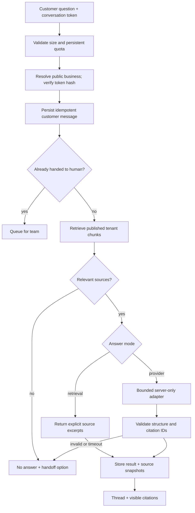

# SupportDesk architecture and schema (planned)

## Routes
`/demo` synthetic inbox; `/app/[workspaceId]/inbox`, `/knowledge`, `/settings`, `/leads`; `/support/[publicSlug]` published support UI; `/api/support/[publicSlug]/messages` bounded public endpoint. Browser cannot choose workspace_id authoritatively: server resolves slug/public config and conversation token.

## Data model
| Table | Fields/constraints/indexes |
|---|---|
| `sd_businesses` | workspace_id PK/FK, public_slug unique, display_name, public_enabled false default, mode retrieval/provider, retention_days bounded |
| `sd_sources` | id, workspace_id, title 1–120, body normalized text bounded, content_hash, state draft/published, created_by/timestamps; unique(workspace_id,content_hash); archive/unpublish |
| `sd_chunks` | id, workspace_id, source_id composite FK, ordinal, body, searchable tsvector, source_version; unique(source_id,ordinal,source_version), GIN search index + workspace lookup |
| `sd_conversations` | id, workspace_id, token_hash unique, status open/needs_human/resolved, assigned_to, created_at, updated_at; index(workspace_id,status,updated_at) |
| `sd_messages` | id, workspace_id, conversation_id composite FK, author customer/assistant/teammate, body, mode retrieval/generated/human/error, client_request_id, created_at; unique(conversation_id,client_request_id) |
| `sd_citations` | message_id + source/chunk reference, safe title/snippet snapshot, ordinal, workspace_id; validated retrieved IDs only |
| `sd_leads` | id, workspace_id, conversation_id, email, consent_at, created_at; no unsolicited collection |
| `sd_usage_buckets` | workspace_id, hashed requester scope, window_start, request_count, tokens_reserved; transactional increment/check; cleanup retention |

## Module contracts
`ingestSource(unknownInput)` validates text/type/size, normalizes, hashes, deterministically chunks with character/token budget. Transaction marks source ready only after chunks succeed. No arbitrary outbound URL fetch, eliminating initial SSRF crawler risk.
`retrieve(workspaceId,question)` is tenant-scoped before search ranking and only published records. Public access through a narrowly granted function/server boundary, never exposing all private source bodies.
`answer({question,chunks,mode})` → discriminated `{kind:'retrieval'|'generated'|'handoff', text, citations}`. Citations must be a subset of retrieved chunk IDs; syntactic citation validity is not semantic correctness, so evaluation still required.
`postMessage` validates conversation secret, quota, idempotency and state transactionally. No provider call inside long database transaction; reserve request state then complete with expected state/version and recovery semantics. If human handoff happened during generation, do not publish the stale AI answer.

## Security threats
Prompt injection stays untrusted text; model gets no admin secrets, SQL executor or third-party tools. Retrieval itself must deny cross-tenant/source leaks. Rate limiting plus max tokens/provider timeouts/circuit disable prevent cost abuse; origin checking is defense-in-depth, not authentication. Bearer conversation tokens high-entropy, hashed at rest; don't log them or put them in public URLs; short retention and rotation strategy.
